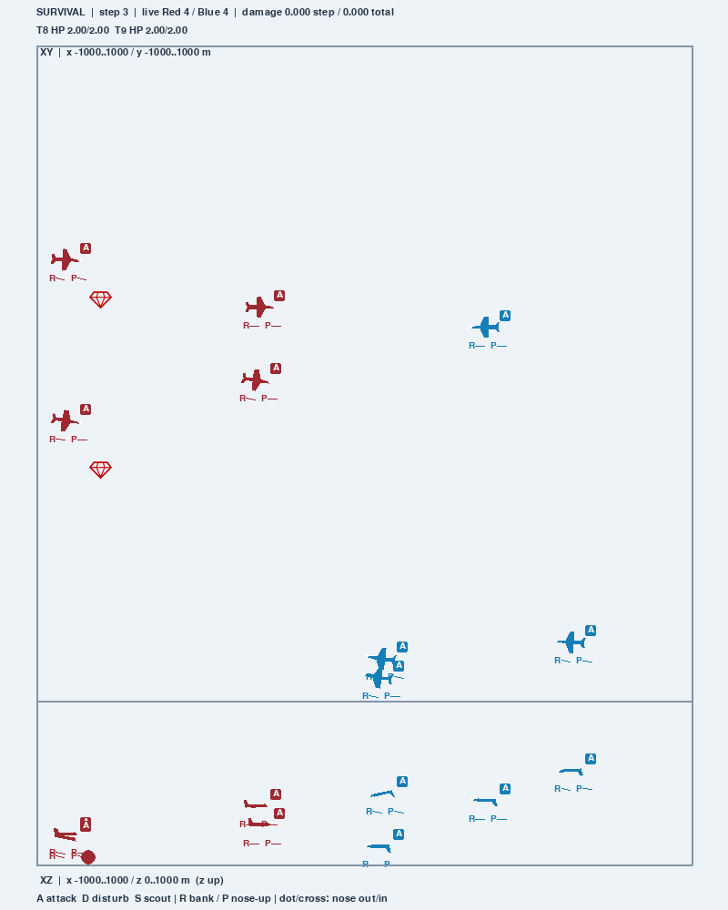

# SkyHAD

SkyHAD is an aerial attack-defense environment for multi-agent reinforcement learning. Red defends stationary assets against Blue. Choose particle, six-degree-of-freedom fixed-wing, or quadrotor dynamics; collision, automatic attack and task rules are shared. One `had-env` distribution contains the native simulator and optional research workbench. No learning algorithm is included.

## Install and run

Use **Python 3.10–3.12**. The base installation needs NumPy, SciPy, Gymnasium and PettingZoo; desktop/rendering dependencies are optional.

```bash
git clone https://github.com/Sailero/SkyHAD.git
cd SkyHAD
python -m pip install -e .
python examples/quickstart.py
```

```python
from had_env import make_env

env = make_env(env_agent_type="UAV_quadrotor", task_mode="damage",
               red_count=4, blue_count=4, target_count=2, max_cycles=100)
observations, infos = env.reset(seed=42)
try:
    while env.agents:
        actions = {agent: env.action_space(agent).sample() for agent in env.agents}
        observations, rewards, terminated, truncated, infos = env.step(actions)
finally:
    env.close()
```

This loop samples both teams. For a reproducible defender comparison with frozen Blue navigation and a replaceable Red callable, run:

```bash
python examples/defender_evaluation.py --model UAV_quadrotor --task damage --seeds 11 12 13 --horizon 100
```

The [benchmark protocol](docs/BENCHMARK.md) explains the six acceleration demonstrations, policy replacement and correct metrics. Parallel/MPE callers supply opponent navigation explicitly; automatic fire is part of the simulator.

## Choose a task and control

| Setting | Options |
| --- | --- |
| `env_agent_type` | `particle`, `UAV_fixedwing`, `UAV_quadrotor` |
| `env_agent_action_type` | `acceleration`, `position`; UAVs also support `actuator` |
| `task_mode` | `survival`, `damage` |
| `api` | `parallel` (default), `mpe`, `grouping` |
| `spatial_dim` | 3 (factory default); particle also supports 2 |

These choices provide **16 native model/action/task combinations**. Position commands move through a controller; UAV acceleration intentions also pass through existing flight controllers. Actuator commands specify physical inputs directly. Fixed-wing aircraft cannot hover.

**Survival:** destruction of any asset is a Red loss; eliminating all Blue Attack agents is a Red win. The default native terminal team reward is +10/-10. **Damage:** Red minimizes cumulative raw asset damage and receives minus the new damage each step; Blue receives the opposite reward. Asset health stays fixed for Damage accounting.

Each agent receives its team's full reward. Count it once per step, including after individual casualties; do not sum it across teammates. Native `max_cycles` is a sampling truncation and never awards a win. See [API details](docs/API.md) for observation units, masks, role counts, configuration and initialization.

## Grouping decisions

```python
from had_env import make_env
from had_env.grouping.policies import RulePolicy

env = make_env(api="grouping", red=8, blue=8, targets=2,
               task_mode="damage", max_steps=100)
policy = RulePolicy("rule")
try:
    state = env.reset(seed=42)
    while not env.done:
        state, reward, done, info = env.step(policy.act(state))
finally:
    env.close()
```

Grouping assigns surviving defenders to assets or reserve; its lower executor produces acceleration intentions. It supports all three models and includes Blue assignment/rush rules. `info["delta"]` counts physical steps advanced to each decision boundary. Grouping Survival has its own reward and horizon convention, documented in the API.

## Optional research workbench

```bash
python -m pip install -e ".[viewer]"
skyhad-workbench live --agent-type UAV_fixedwing --policy rule
skyhad-workbench record --policy rule --output outputs/episode.json.gz
skyhad-workbench inspect outputs/episode.json.gz
skyhad-workbench view outputs/episode.json.gz
skyhad-workbench branch outputs/episode.json.gz --step 0 --policy grand --seed 20260909 --output outputs/branch.json.gz
skyhad-workbench view outputs/episode.json.gz --compare outputs/branch.json.gz
skyhad-workbench export outputs/episode.json.gz outputs/figure.png --step 10
skyhad-workbench export outputs/episode.json.gz outputs/episode.mp4 --fps 30 --steps-per-second 5
skyhad-workbench evaluate examples/evaluation.json --policies rule grand --training-seeds 0 --output outputs/evaluation
```

`had-workbench` and `python -m skyhad_workbench` are aliases of the same CLI. The live Qt viewer supports pause, physical single-step, next decision/event, selection, overlays, comparison and branching. `live --native` selects direct flight controls; `--agent-action-type position` or `actuator` uses `--action-mode continuous_native`. Native external policies connect through `FlightSession`; the CLI's `--policy` names select grouping policies.

Replay uses `view`; historical JSON/GZ records remain readable. Exact continuation requires compatible scientific behavior/configuration and a recorded snapshot. CLI `branch --step` selects a recorded grouping decision boundary (listed by `inspect`); native flight branching uses `FlightSession.branch`. Export the current XY/XZ scene as PNG/SVG/PDF with the viewer's **导出画面** control. CLI `export` creates a scientific map/profile/alive-count chart with attribution, supporting PNG/SVG/PDF or MP4 plus metadata sidecars. Paired ID/OOD evaluation above applies to grouping Survival policies; native defender and Damage results use the separate protocol linked above.



Actual fixed-wing Survival render from the grouping rule session, seed 20260907, after physical stepping. The workbench and native renderer use the same simulator and aircraft geometry.

## Basic rendering and tests

```bash
python -m pip install -e ".[render]"  # Pygame rendering without the Qt workbench.
python -m pip install -e ".[viewer,test]"
python -B -m pytest -q -p no:cacheprovider
```

Set native `render_mode="human"` for a window or `"rgb_array"` for RGB pixels. Rendering does not change observations, physics or RNG. CI tests Ubuntu/Windows on Python 3.10/3.12, a fresh headless installed wheel, and offscreen viewer/export behavior. Torch is optional and its dedicated tests skip when absent. `.venv/`, generated outputs and caches are ignored local files, not distributed source.

## Read the environment

Start with [quickstart](examples/quickstart.py), then trace an action through `factory.py` → `environment.step()` → `simulation.step_physics()` → `world.step()`. The world predicts motion, resolves synchronous collisions and automatic fire, then applies simultaneous damage. `dynamics/` and `agents/` provide physical evolution; `observations.py` packs actor/critic features and `tasks.py` computes rewards/endings. `env.simulation` is the sole simulator with fixed-order `entities`.

| Files | Responsibility |
| --- | --- |
| `had_env/__init__.py`, `factory.py`, root `make_env.py` | Public construction and one software version |
| `config.py`, `scenario.py`, `initialization.py`, `actions.py` | Resolved model/geometry, rosters, seeded layouts and direction tables |
| `environment.py`, `mpe.py` | Parallel and fixed-list action/observation lifecycle |
| `simulation.py`, `world.py`, `geometry.py`, `agents/`, `dynamics/` | Native stepping, combat, entity roles and motion/controllers |
| `observations.py`, `tasks.py` | Actor/critic encoding, damage, rewards and natural endings |
| `had_env/grouping/` | Optional upper-level assignments and lower rule execution |
| `had_env/render/`, `resources/` | Optional rendering, vector glyphs and asset icons |
| `skyhad_workbench/session.py`, `agent_session.py` | Optional grouping/native session execution and policy integration |
| Workbench `recording.py`, `playback.py`, `snapshot.py`, `rng.py`, `identity.py` | Records, historical replay and independent exact continuation |
| Workbench `protocols.py`, `evaluation.py` | Scenario contracts and paired evaluation |
| Workbench `live.py`, `gui.py`, `views.py`, `export.py`, `cli.py` | Owned debug workers, Qt views, exports and CLI |
| `examples/`, `tests/`, `docs/` | Minimal loops, behavior/packaging checks and API/model documentation |
| `pyproject.toml`, `LICENSE`, `.github/workflows/tests.yml` | One distribution, MIT license and supported-platform CI |

Reading the core does not require the optional grouping/workbench code. For tools, start with the [recording example](examples/recording.py), then the relevant session, recording/snapshot and view/export modules. No second simulator, algorithm-specific adapter or separate tool installation is required.

## Mathematical formulation and versions

[MODELING.md](docs/MODELING.md) introduces the two tasks and defender Dec-POMDP. The [36-page continuous IEEE formulation](docs/PROBLEM_FORMULATION.pdf) has shared material and two-page sections for all 16 themes; its [LaTeX source](docs/PROBLEM_FORMULATION.tex) remains editable. It distinguishes the full mathematical Markov state from the packed critic features returned by `state()`. [VALIDATION.md](docs/VALIDATION.md) records release checks and historical checkpoints.

The current unified release line is **v4.1.0** (this candidate: **v4.1.0rc1**). The distribution remains `had-env`; imports remain `had_env` and `make_env`. **v4.0.2** refined the continuous paper-style formulation while preserving **v4.0.0** environment behavior. The original complete **v3.0.0** release, **baseline-v4-20261008**, and stage tags remain recovery points. The historical [SkyHAD-Workbench v1.0.0 repository](https://github.com/Sailero/SkyHAD-Workbench) was pinned to SkyHAD v3.0.0; its capabilities now ship here.

MIT License, copyright 2026 Saileron. See [LICENSE](LICENSE).
